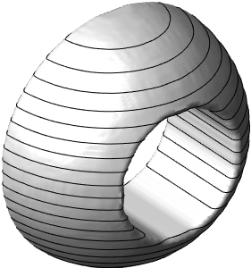

# PolyhedronToPolygons


A matlab function to convert a polyhedron (mesh representation) to a set of polygons as used in the DICOM file format. This is sometimes necessary in order to export data to treatment planning systems. 

The output is a set of 2D shapes, one in each slice. 

Example: 
```matlab
  %%
  %Create a logical array where points inside a structure is true and
  %outside are false
  dx = 0.1;
  x = -7:dx:7.3;y = -7:dx:7; z = -7:dx:7.0;
  [X, Y, Z] = meshgrid(x, y, z);
  I0 = sqrt(X.^2 + Y.^2 + Z.^2) < 5;

  I0(sqrt(X.^2 + Z.^2) < 2.5) = false;
  I0(y>0,:,:) = false;
  %Turn it into a smooth function for use in isosurface
  I0smooth = smooth3(I0, 'box', 5);
  %Find the isosurface as a polyhedron
  surface = isosurface(X, Y, Z, I0smooth, 0.5);
  
  %show the surface
  patch(surface, 'EdgeColor', 'none', 'FaceColor', [0.7 0.7 0.7]);
  %camlight
  camlight(-60,-10)
  camlight(-30,-10)
  lighting gouraud
  view(3)
  axis off
  hold on
  
  %Find the polygonal representation
  R = polyhedronToPolygons(surface.vertices, surface.faces, z(1:5:end));
  
  %plot the result
  plotPolygons(R);
```

Documentation of the main function:
```matlab
% R = polyhedronToPolygons(vertices, faces, zCoords)
%
% Converts a polyhedron to a set of polygons with
% different z-coordinates. This representation (the set of polygons) is
% used for defining the outline of organs/regions of interest in the DICOM
% file format (within the RTstruct in the DICOM file).
%
% Input parameters:
% vertices: n by 3 array of the vertices of the polyhedron. There are n
% vertices, and each vertex has an x, y and z-coordinate.
%
% faces: m by 3 array of faces of the polyhedron. Each face has three
% coordinates, and each row of this array points to the index of the three
% vertices in the "vertices" array. See isosurface for more details on the
% representation of a polyhedron as vertices/faces.
%
% zCoords: Array of k z-coordinates for which to compute polygons.
%
% sliceDir (optional): Selects which direction is the "z" direction along
% which the slices are found (1, 2 or 3). Default: 3.
%
%
% Output parameters:
% R: k times 1 cell array containing the polygons. Polygons are defined by
% q by 3 arrays of vertices (x, y and z coordinates; the z-coordinate is
% constant for each polygon). There is an edge between each adjacent vertex
% in the array, and an edge between the last and first vertex. There may be
% multiple polygons in each plane (even if the polyhedron is connected),
% therefore each cell of R is itself a cell array that contains zero or
% more polygon definitions. 
%
```
